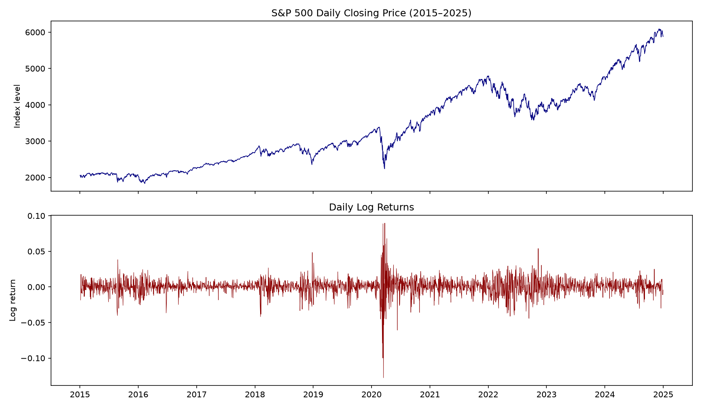
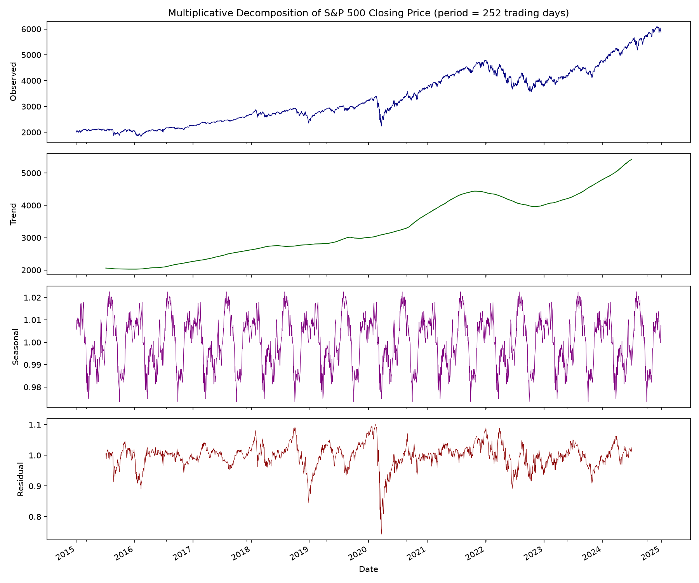
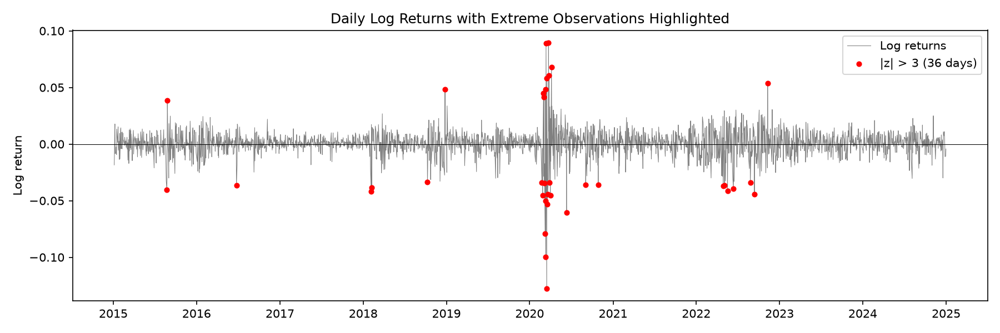
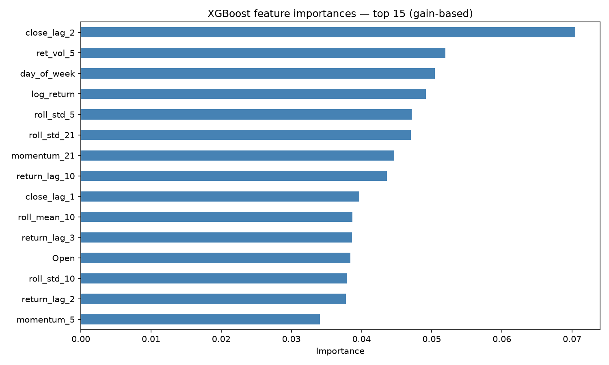
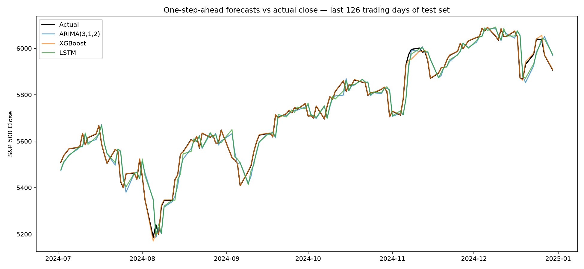
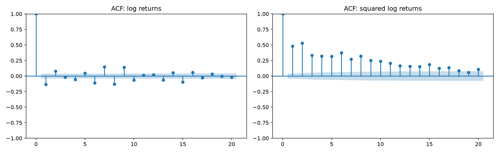
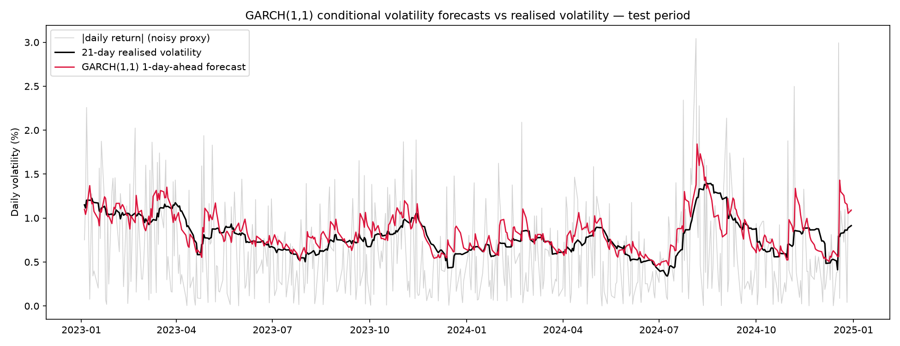
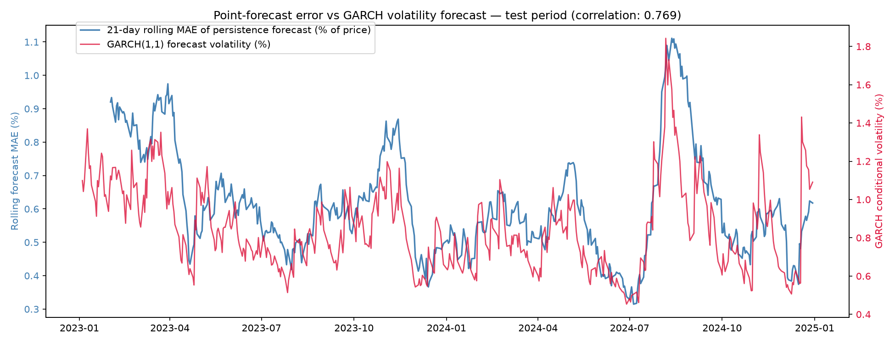

# Question 2: Advanced Time Series Forecasting

## 2.1 Dataset Understanding and Literature Review

### 2.1.1 Data Source, Frequency, Size, and Characteristics

This study uses daily S&P 500 index data (ticker `^GSPC`) retrieved from Yahoo Finance via the `yfinance` Python library, covering 2 January 2015 to 31 December 2024 — 2,516 trading-day observations (an average of 252 per year), with prices adjusted for splits and dividends. Each observation contains open, high, low, close, and volume values; the analysis focuses on the closing price and the daily log returns derived from it. To ensure reproducibility, the data was downloaded once and frozen as a raw CSV snapshot from which all subsequent analysis proceeds. The S&P 500 aggregates the market capitalisation of roughly 500 large US-listed firms and is the standard benchmark series in the forecasting literature, making results directly comparable to prior work.

The series exhibits the temporal characteristics required by the brief. The closing price shows a pronounced long-run upward trend, rising from a minimum of 1,829 to a maximum of 6,090 over the decade (mean 3,356), punctuated by irregular cyclic drawdowns — most notably the COVID-19 crash of March 2020 and the 2022 bear market. Daily log returns average 0.0004 with a standard deviation of 0.0113, but are far from normally distributed: they display negative skewness (−0.81) and severe excess kurtosis (15.76), indicating heavy tails in which extreme moves occur far more often than a Gaussian model would predict. The largest single-day loss (−12.77%, 16 March 2020) and largest gain (+8.97%, 24 March 2020) occurred within eight days of each other, illustrating the volatility clustering that motivates the GARCH analysis in Section 2.4. As exchange-traded data, the series contains no missing values; gaps in the calendar correspond only to weekends and market holidays.

**Table 2.1 — Descriptive statistics**

| Statistic | Closing price | Daily log returns |
|---|---|---|
| Observations | 2,516 | 2,515 |
| Mean | 3,356.12 | 0.00042 |
| Std. deviation | 1,083.90 | 0.01127 |
| Minimum | 1,829.08 | −0.1277 (16 Mar 2020) |
| Maximum | 6,090.27 | 0.0897 (24 Mar 2020) |
| Skewness | — | −0.81 |
| Excess kurtosis | — | 15.76 |

**Figure 2.1** — S&P 500 daily closing price (top) and daily log returns (bottom), January 2015 – December 2024.

Figure 2.1 illustrates the key temporal properties of the series. The price level (top) shows a strong upward trend punctuated by three major drawdowns: the late-2018 correction, the COVID-19 crash of March 2020, and the 2022 bear market. The log returns (bottom) fluctuate around zero but with clearly time-varying dispersion — extended calm periods such as 2017 contrast with concentrated bursts of extreme movement in 2020 and 2022. This clustering of volatility, alongside the heavy-tailed distribution reported in Table 2.1, indicates conditional heteroscedasticity in the returns and directly motivates the GARCH modelling in Section 2.4.

### 2.1.2 Forecasting Target and Prediction Horizon

**Forecasting targets (summary):**

- **Forecasting models (ARIMA / LSTM / XGBoost):** next-day closing price, one-step-ahead (h = 1), evaluated with MAE / RMSE / MAPE
- **GARCH(1,1):** one-day-ahead conditional variance of daily log returns

Two complementary forecasting targets are defined, reflecting the two analytical components of this study.

For the forecasting model comparison (Section 2.3), the target variable is the next-day closing price of the S&P 500, i.e. a one-step-ahead (h = 1) horizon at daily frequency. Given information up to trading day *t*, each model produces a forecast of the closing price at day *t+1*, evaluated on a chronologically held-out test period using MAE, RMSE, and MAPE. The one-day horizon is the standard configuration in the comparative literature [1]–[4] and ensures the three model families are compared on identical terms, since multi-step forecasting would require model-specific recursive strategies that confound the comparison.

For volatility modelling (Section 2.4), the target is the conditional variance of daily log returns, forecast one day ahead using a GARCH(1,1) specification. Log returns are used rather than raw prices because volatility is a property of returns, and because returns are the stationary transformation of the price series (verified in Section 2.2).

This dual formulation reflects a central finding of financial econometrics: in a near-efficient market the level of returns is close to unpredictable, whereas the volatility of returns is strongly persistent and therefore forecastable [6]. The study is accordingly framed as a rigorous comparison of model families on a challenging real-world series, rather than a claim to accurate price prediction.

### 2.1.3 Literature Survey

Research on financial time series forecasting divides broadly into three strands: classical statistical models, deep learning approaches, and volatility modelling.

Within the classical-versus-deep-learning strand, Pilla and Mekonen compared ARIMA and LSTM on daily S&P 500 data (2013–2024), finding that ARIMA captured short-term trends effectively (MAE 462.1, RMSE 614) but was constrained by its linearity assumptions, while LSTM better handled the non-linear dependencies in the series [1]. Sunki et al. reached similar conclusions in a three-way comparison of ARIMA, LSTM, and Facebook Prophet on stock market data [2]. Rather than treating the approaches as competitors, Kashif and Ślepaczuk combined them: their LSTM-ARIMA hybrid, which feeds ARIMA residuals into an LSTM, outperformed both standalone models across the S&P 500, FTSE 100, and CAC 40 over a 23-year walk-forward evaluation [3], suggesting the two families capture complementary structure.

The machine learning strand treats forecasting as supervised regression on engineered temporal features. Gifty and Li compared LSTM, ARIMA, and XGBoost for stock price prediction and found that a tuned XGBoost delivered the most accurate predictions, outperforming both the individual models and ensemble combinations [4] — evidence that gradient boosting over lag features is competitive with sequence models at daily frequency.

The volatility strand builds on the ARCH/GARCH family. Marisetty evaluated six GARCH variants across the S&P 500, FTSE 100, Hang Seng, and NIKKEI 225 over twenty years (2004–2023), confirming that GARCH-type models capture volatility clustering across regimes including the 2008 crisis and the COVID-19 pandemic, with asymmetric variants such as TGARCH best capturing leverage effects [5]. Bridging the strands, Roszyk and Ślepaczuk compared GARCH, LSTM, and hybrid LSTM-GARCH models for S&P 500 volatility forecasting (2000–2023), finding that a hybrid incorporating the VIX index reduced forecast RMSE by roughly 46% relative to standalone GARCH — while GARCH remained the interpretable benchmark against which improvements are measured [6].

### 2.1.4 Limitations of Existing Approaches and Motivation for Selected Models

Three limitations recur across the surveyed studies. First, conclusions about which model family performs best are inconsistent — LSTM dominates in [1] and [2], XGBoost in [4], and hybrids in [3] — suggesting strong sensitivity to the asset, period, and evaluation design. Many studies also compare only two families, leaving the three-way picture incomplete. Second, price-level studies often report impressive fit statistics that mask near-random-walk behaviour in returns: a model that essentially predicts "tomorrow ≈ today" can achieve a high R² on a trending price series while offering little genuine predictive value. Third, point-forecast studies typically ignore second-moment dynamics entirely, while volatility studies rarely connect back to point forecasting, despite evidence that volatility is the more predictable quantity in financial series [6].

These limitations directly motivate the design of this study. Four models are selected, one from each methodological family, and evaluated under identical conditions:

**ARIMA** is selected as the classical statistical benchmark. It is the standard baseline in every surveyed comparison [1]–[4], is grounded in explicit assumptions (linearity, stationarity after differencing) that can be tested rather than assumed, and provides an interpretable reference point against which the added value of more complex models can be measured. A comparison without a classical baseline cannot distinguish genuine model skill from the difficulty of the series itself.

**LSTM** is selected as the deep learning representative because its gating architecture is designed to capture the non-linear, long-range temporal dependencies that ARIMA's linear structure cannot [1], and because it is the most consistently studied neural architecture in the financial forecasting literature, making results directly comparable to prior work [1]–[3].

**XGBoost** is selected as the machine learning representative following evidence that gradient boosting over engineered lag and rolling-window features can match or exceed sequence models at daily frequency [4]. It approaches the problem from a fundamentally different angle — tabular supervised regression rather than sequence modelling — which makes the three-way comparison a genuine contrast of paradigms rather than of hyperparameters. Its use here also provides methodological continuity with Question 1, where XGBoost was the best-performing classifier.

**GARCH(1,1)** is selected for volatility modelling because the exploratory analysis (Section 2.1.1) already reveals the two properties GARCH exists to model: severe excess kurtosis (15.76) and visible volatility clustering. While hybrid extensions can improve forecast accuracy [6], the standard GARCH(1,1) remains the interpretable benchmark whose parameters (α, β) directly quantify volatility persistence [5], making it the appropriate choice where the goal is to model and explain volatility behaviour rather than to minimise forecast error alone.

Addressing the first limitation, all three forecasting models are tuned and evaluated on a single series with an identical chronological train/validation/test split. Addressing the second, stationarity is tested explicitly (Section 2.2) and results are interpreted against a naïve persistence baseline. Addressing the third, volatility modelling is treated as a co-equal component of the study rather than an afterthought.

---

## 2.2 Time Series Exploration and Preprocessing

### 2.2.1 Decomposition and Analysis of Trend, Seasonality, and Irregular Patterns

The closing price was decomposed into trend, seasonal, and residual components using multiplicative decomposition with a period of 252 trading days (one trading year). A multiplicative model was chosen because the magnitude of fluctuations grows with the index level, as visible in Figure 2.1.

The decomposition (Figure 2.2) shows the series is dominated by its trend component, which rises smoothly from roughly 2,050 to 5,400 over the decade, capturing the 2020–2021 recovery and the 2022 drawdown. The extracted seasonal component is small — a peak-to-trough range of 4.91% around the trend — and should be interpreted with caution: classical decomposition constrains the seasonal pattern to repeat identically each year, so its apparent regularity overstates any genuine calendar effect. In contrast, the residual component is substantial (standard deviation 0.0386, comparable to the entire seasonal amplitude) and contains the largest movements in the decomposition, falling to approximately 0.75 during the March 2020 crash. The bursts of residual variation are visibly clustered in time rather than evenly spread.

Two conclusions follow. First, deterministic calendar seasonality is negligible relative to trend and irregular variation, so seasonal models alone cannot describe this series — supporting the selection of models that capture stochastic dynamics (ARIMA, LSTM, XGBoost). Second, the clustered structure of the residual component reinforces the evidence of conditional heteroscedasticity identified in Section 2.1, further motivating the GARCH analysis in Section 2.4.

**Figure 2.2** — Multiplicative decomposition of the S&P 500 closing price (observed, trend, seasonal, residual; period = 252 trading days).

### 2.2.2 Missing Values, Anomalies, and Outliers

The dataset contains no missing values within trading days. Of the 3,652 calendar days in the sample period, 2,516 are trading days; the remaining 1,136 correspond to weekends and market holidays. These gaps are structural rather than data-quality defects — the market is closed and no true value exists to impute — so, following standard practice in financial econometrics, the series is modelled on its trading-day index and no imputation is performed.

Outliers were assessed on daily log returns using a z-score criterion. Thirty-six days (1.43% of observations) exceed |z| > 3, roughly five times the 0.27% expected under a normal distribution — quantitative confirmation of the heavy tails reported in Section 2.1. Inspection of the most extreme days confirms these are genuine market events rather than data errors: all ten of the largest absolute moves occurred in 2020 during the COVID-19 shock, including the −12.77% fall of 16 March 2020, and Figure 2.3 shows extreme observations concentrating in crisis episodes (2020, 2022) while entire calm years contain none. This temporal clustering of extremes is itself a symptom of the conditional heteroscedasticity modelled in Section 2.4.

A deliberate decision was taken to retain all extreme observations. Removing or winsorising them was rejected for three reasons. First, they are accurate records of real market behaviour; removing them would fit models to a market that does not exist. Second, honest out-of-sample evaluation requires the test period to reflect genuine conditions, including turbulence. Third, for the volatility analysis these extremes are the signal, not noise — deleting them would erase the volatility clustering that GARCH exists to model. The practical impact of extreme values on model training is instead managed in preprocessing: features for the LSTM are scaled using parameters fitted on the training set only, which bounds the influence of extreme inputs on gradient-based optimisation without discarding information.

**Figure 2.3** — Daily log returns with extreme observations (|z| > 3) highlighted; 36 days exceed the threshold, clustered in crisis periods.

### 2.2.3 Stationarity Testing and Transformation

Stationarity was assessed using two complementary tests with opposing null hypotheses: the Augmented Dickey-Fuller test (H₀: unit root, i.e. non-stationary) and the KPSS test (H₀: stationary). Requiring agreement between the two guards against conclusions driven by the low power of either test individually.

The results are unambiguous. For the closing price level, the ADF test fails to reject a unit root (statistic 0.449, p = 0.983) while KPSS rejects stationarity (statistic 7.50, p < 0.01): both tests agree the price series is non-stationary, consistent with its strong trend. For daily log returns, the ADF test rejects the unit root emphatically (statistic −15.73, p < 0.001) while KPSS fails to reject stationarity (statistic 0.050, p > 0.10): both tests agree the returns are stationary.

**Table 2.2 — Stationarity test results**

| Series | ADF statistic | ADF p-value | KPSS statistic | KPSS p-value | Conclusion |
|---|---|---|---|---|---|
| Closing price (level) | 0.449 | 0.983 | 7.50 | < 0.01 | Non-stationary |
| Daily log returns | −15.73 | < 0.001 | 0.050 | > 0.10 | Stationary |

Log returns are, by construction, the first difference of log prices, so this result establishes that a single differencing operation transforms the series to stationarity — i.e. the log price is integrated of order one, I(1). This finding drives three modelling decisions. First, it fixes the integration order of the ARIMA model at d = 1 (applied to log prices), a value determined by testing rather than assumption. Second, it justifies the log-return transformation as the "necessary transformation" for models requiring stationary input. Third, it licenses the GARCH analysis of Section 2.4, which requires a weakly stationary input series.

One important nuance qualifies this result: ADF and KPSS assess stationarity of the mean. The returns series is mean-stationary, but Sections 2.1–2.2 documented pronounced time-variation in its variance (volatility clustering, heavy tails, clustered extremes). This combination — a stable mean with unstable variance — is precisely the condition of conditional heteroscedasticity, and it defines the division of labour in this study: the forecasting models of Section 2.3 target the (largely unpredictable) mean, while the GARCH model of Section 2.4 targets the (strongly persistent) variance.

### 2.2.4 Temporal Feature Engineering

To enable the machine learning models — particularly XGBoost, which has no native representation of time — a supervised feature matrix was constructed in which every feature at day *t* uses only information available at day *t* or earlier, and the target is the closing price at day *t+1*. Three families of temporal features were created:

**Lag variables.** Closing price and log return at lags of 1, 2, 3, 5, and 10 trading days, capturing the most recent market state plus one-week and two-week lookbacks. Under the near-random-walk behaviour of daily prices, no individual lag is expected to carry strong predictive signal for next-day returns — an expectation examined directly through the fitted model's feature importances in Section 2.3.3.

**Rolling statistics.** Rolling means and standard deviations of the closing price over 5-, 10-, and 21-day windows — chosen to correspond to one trading week, two weeks, and one trading month respectively, so each window has a market interpretation. In addition, rolling standard deviations of log returns over 5 and 21 days serve as realised-volatility proxies, giving the models access to the volatility-clustering structure documented above; the 21-day realised volatility later provides the comparison series for the GARCH forecasts. Momentum features (5- and 21-day percentage price changes) complete this family, following their standard use in the comparative literature [4].

**Seasonal indicators.** Day-of-week, month, and quarter. Given that the decomposition found seasonality to be weak, these features are expected to carry little predictive weight — but their inclusion converts that expectation into a testable claim, examined against the fitted model's feature importances in Section 2.3.3.

Constructing lags and rolling windows consumes the first 21 observations, and the one-step-ahead target consumes the final observation, leaving 2,494 modelling rows — every removed row is accounted for by construction rather than by data quality issues. No further cleaning was required: missing values are absent, outliers are deliberately retained (Section 2.2.2), and all features are numeric. Model-specific preparation is deferred to Section 2.3, where scaling for the LSTM is fitted on the training split only, to avoid leaking test-period statistics into training — the same temporal-leakage discipline applied in Question 1. Tree-based and classical models require no scaling: XGBoost is invariant to monotonic feature transformations, and ARIMA consumes only the univariate series. The processed feature set was saved as a separate CSV, preserving the raw snapshot unchanged.

## 2.3 Model Development: Traditional and Deep Learning Models

### 2.3.1 Evaluation Protocol: Time-Aware Splitting and a Persistence Baseline

All models are developed and evaluated under a single, chronologically ordered protocol. The 2,494 modelling rows were partitioned by calendar date rather than by random sampling: the training set spans February 2015 to December 2021 (1,742 observations, 69.8%), the validation set covers calendar year 2022 (251 observations, 10.1%), and the test set covers January 2023 to December 2024 (501 observations, 20.1%). Random splitting is inadmissible for time series because it would place future observations in the training set, allowing models to learn from information that would not exist at prediction time — the same temporal-leakage discipline applied to the transaction data in Question 1. A calendar-based split was preferred over a proportional row split because the resulting periods are economically interpretable: the validation year, 2022, was a sustained bear market with elevated volatility, making it a demanding setting for hyperparameter selection, while the test period contains the 2023–2024 bull run whose price levels exceed anything seen in training — a genuine out-of-distribution challenge discussed further below. Each model's hyperparameters are selected using only training and validation data; the test set is used exactly once, for the final comparison reported in Section 2.3.5.

All models are evaluated on the same target — the next-day closing price (h = 1) defined in Section 2.1.2 — using MAE, RMSE, and MAPE in price units. Models that internally predict log returns have their forecasts converted back to price levels before scoring, so the comparison is conducted on identical terms throughout.

Before any model is fitted, a naive persistence baseline is established: the forecast for tomorrow's close is simply today's close. For a series whose returns are near-unpredictable (Section 2.1.4), persistence is known to be a demanding benchmark rather than a formality [1], and reporting it converts each model's error from an isolated number into a measure of genuine added value. On the test period the persistence baseline achieves MAE 29.82, RMSE 39.43, and MAPE 0.621% — that is, tomorrow's close is on average within about 0.6% of today's. Every subsequent model is judged against this reference.

### 2.3.2 ARIMA

The ARIMA model was fitted to log closing prices, so that with an integration order of d = 1 the model is exactly an ARMA process on daily log returns — connecting the specification directly to the stationarity results of Section 2.2.3, which established that log prices are I(1) and log returns are stationary. The integration order is therefore fixed by testing rather than searched over, and hyperparameter selection reduces to the autoregressive and moving-average orders (p, q).

These were selected by exhaustive grid search over p, q ∈ {0, 1, 2, 3} — sixteen candidate specifications — fitted on the training set only and ranked by the Akaike Information Criterion, which trades off in-sample likelihood against parameter count and thereby penalises overfitting. ARIMA(3,1,2) minimised AIC (−10,803.0), with a clear margin of roughly 77 AIC points over the second-ranked specification, indicating that the selection is not an artefact of near-ties.

For test-set forecasting, the selected model was re-estimated on the combined training and validation data (all observations preceding 2023) and applied in a walk-forward, one-step-ahead scheme: at each test day the model forecasts the next close, then the actual observation is appended to its information set with parameters held fixed. This mirrors deployment conditions — the model always conditions on the most recent real data — while guaranteeing that no test-period observation influences parameter estimation. A single multi-step forecast over the 501-day test horizon was rejected as an alternative, since an ARIMA forecast at long horizons collapses to the unconditional drift and would neither match the one-step-ahead target definition nor provide a fair comparison with the other models.

ARIMA(3,1,2) achieved MAE 30.60, RMSE 40.24, and MAPE 0.637% on the test set — marginally worse than the persistence baseline. The interpretation is instructive rather than disappointing: after differencing, the autocorrelation remaining in daily log returns is too weak to exploit, so the fitted ARMA terms model in-sample noise that does not generalise. This is precisely the near-random-walk behaviour that Section 2.1.4 identified as being masked by price-level fit statistics in parts of the literature.

### 2.3.3 XGBoost with Temporal Features

XGBoost was trained as a supervised regressor on the 29-feature temporal matrix constructed in Section 2.2.4. A critical design decision concerns the prediction target. Gradient-boosted trees predict by averaging training-set target values in their leaves and therefore cannot extrapolate beyond the range of the training data. Training prices peak near 4,800, while the 2023–2024 test period reaches 6,090; a model trained to predict the price level directly would saturate at approximately the training maximum and fail systematically throughout the test period. The model was therefore trained to predict the next-day log return — a stationary, range-bound quantity — with the price forecast reconstructed as the current close multiplied by the exponential of the predicted return. This choice converts the out-of-distribution price problem into an in-distribution return problem and is a direct application of the stationarity findings of Section 2.2.3.

Hyperparameters were tuned by grid search over the dimensions that most govern model capacity — number of trees (200, 500), maximum depth (3, 5), and learning rate (0.01, 0.05), with subsampling of rows and features fixed at 0.8 for regularisation — evaluated by RMSE on the 2022 validation year, with forecasts converted to price space so that the tuning criterion matches the final evaluation metric. Standard k-fold cross-validation was deliberately avoided: shuffled folds would train on observations that postdate their validation folds, reintroducing the temporal leakage the split was designed to prevent. Validation on a strictly later, held-out year is the time-series-appropriate analogue.

The search space was intentionally compact, and the tuning results vindicate this: the most conservative configuration (200 trees, depth 3, learning rate 0.01) achieved the best validation RMSE, and error increased monotonically with every added increment of capacity. This pattern is direct empirical evidence that the predictable signal in daily returns is weak — additional capacity is spent memorising noise — and it justifies restricting the search to shallow, slow-learning configurations rather than searching a larger space blindly.

The final model, refitted on training plus validation data, achieved MAE 29.79, RMSE 39.48, and MAPE 0.619% on the test set — statistically indistinguishable from persistence, with 28 engineered features effectively learning to reproduce the lag-1 close.

The fitted model's feature importances (Figure 2.4) corroborate this interpretation and resolve the expectations set out in Section 2.2.4. The importance profile is strikingly flat: the top-ranked feature (the two-day price lag) accounts for only 7% of total gain, and most features cluster between 3% and 5% — barely above the 3.4% each would receive were importance spread uniformly across all 29. No feature or feature family dominates, and in particular no price lag does, consistent with the return target containing almost no autoregressive signal. The three calendar indicators collectively account for 10.0% of importance — almost exactly their uniform share (10.3%) — so, as the decomposition of Section 2.2.1 anticipated, they contribute nothing beyond noise-level splitting despite day-of-week nominally ranking third. Because gain-based importances are relative and must sum to one even when the model improves on persistence by only 0.1%, a flat profile is precisely the signature of a weak-signal series: the model distributes its splits across many features without extracting meaningful structure from any of them.

**Figure 2.4** — Gain-based feature importances of the final XGBoost model (top 15 of 29 features). The near-uniform profile indicates no feature carries substantial predictive signal for next-day returns.

### 2.3.4 LSTM

The LSTM was framed as a sequence-to-one regressor: given a sliding window of the 21 most recent daily log returns (one trading month, matching the longest rolling-feature window of Section 2.2.4), the network predicts the next day's return, which is then converted back to a price forecast as for XGBoost. Returns rather than prices were used as network input for a scaling analogue of the tree extrapolation problem: a scaler fitted on training-period prices would map the higher test-period prices outside its fitted range, degrading performance for reasons unrelated to the model's temporal capabilities. Returns were standardised using statistics computed on the training period only, so no distributional information from the validation or test periods enters preprocessing.

The architecture was deliberately small: a single LSTM layer of 32 units, followed by dropout of 0.2 and a single linear output unit, trained with the Adam optimiser (learning rate 0.001) under mean-squared-error loss. With only 1,720 training windows available, this restraint is the sequence-model counterpart of the shallow-tree finding above — deeper or wider recurrent architectures, which are routinely fitted to far larger datasets in the literature [1], [3], would overfit almost immediately at this sample size.

Hyperparameter control for the LSTM operates through early stopping: training was capped at 100 epochs with a patience of 10 on validation loss, restoring the best weights on termination. Training halted after 13 epochs, confirming that the network extracts what little predictive structure exists very quickly. Early stopping tunes the parameter that matters most for a small network — effective training duration — and completes a deliberate methodological spread across the three models: information-criterion selection for ARIMA, validation-set grid search for XGBoost, and validation-monitored early stopping for the LSTM, each being the standard tuning paradigm of its model family. Because TensorFlow training is not perfectly deterministic even under fixed random seeds, reported LSTM figures may vary marginally between runs; the qualitative conclusions are unaffected.

The LSTM achieved MAE 29.91, RMSE 39.44, and MAPE 0.623% on the test set — again at the persistence level, with the best test RMSE of the three fitted models by a negligible margin.

### 2.3.5 Results and Interpretation

**Table 2.3 — One-step-ahead test-set performance (January 2023 – December 2024, 501 trading days)**

| Model | MAE | RMSE | MAPE |
|---|---|---|---|
| Naive (persistence) | 29.82 | 39.43 | 0.621% |
| ARIMA(3,1,2) | 30.60 | 40.24 | 0.637% |
| XGBoost (return target) | **29.79** | 39.48 | **0.619%** |
| LSTM (return target) | 29.91 | **39.44** | 0.623% |

**Figure 2.5** — One-step-ahead forecasts versus the actual closing price over the final 126 trading days of the test period. All three model trajectories are visually indistinguishable from the actual series and from each other, each tracking the previous day's close.

The headline result is convergence: three model families with entirely different inductive biases — a linear statistical model, gradient-boosted trees over engineered features, and a recurrent neural network — all land within roughly 1% of the persistence baseline, and none meaningfully beats it. XGBoost is nominally best on MAE and MAPE, the LSTM on RMSE among fitted models, and ARIMA alone falls slightly behind persistence; but differences of this magnitude (fractions of an index point against a mean level above 4,800) carry no practical significance. Figure 2.5 makes the mechanism visible: every model has learned that the best available forecast of tomorrow's close is approximately today's close, so all trajectories shadow the actual series with a one-day lag.

Interpreted individually, each model's result could be mistaken for an implementation failure. Interpreted jointly, the convergence is evidence about the series rather than about the models: it is the empirical signature of weak-form market efficiency at daily frequency, under which past prices contain almost no exploitable information about future returns. This reading is consistent with the literature's inconsistency documented in Section 2.1.4 — where reported model rankings vary with asset, period, and protocol, small noise-driven differences are being ranked — and it validates this study's framing as a comparison of model families on a challenging series rather than a claim to accurate price prediction. It also sharpens the motivation for Section 2.4: the first moment of returns resists forecasting, but the second moment — volatility, whose clustering was documented throughout Sections 2.1 and 2.2 — is where the genuinely predictable structure of this series resides.

---

## 2.4 Volatility Modeling using GARCH

### 2.4.1 Conditional Heteroscedasticity and Volatility Clustering

The forecasting models of Section 2.3 targeted the conditional mean of the series and found it essentially unpredictable. This section targets the conditional variance, motivated by a property documented repeatedly in Sections 2.1–2.2: the dispersion of daily returns is not constant but varies systematically over time.

A series is conditionally heteroscedastic when its variance, conditional on past information, changes over time even though its unconditional mean is stable. In financial returns this manifests as volatility clustering: large price movements (of either sign) tend to be followed by further large movements, and calm periods by further calm — turbulence and tranquillity each persist. The stationarity analysis of Section 2.2.3 anticipated exactly this configuration: ADF and KPSS established that returns are stationary in mean, while the descriptive analysis showed heavy tails (excess kurtosis 15.76) and visually evident clustering, with the worst and best days of the decade occurring within eight days of each other in March 2020. A constant-variance model cannot represent such behaviour; the GARCH family is designed precisely for it.

### 2.4.2 Evidence of Time-Varying Variance

Before fitting, the presence of ARCH effects was verified formally. Figure 2.6 contrasts the autocorrelation function of daily log returns with that of squared returns. Raw returns show only small, scattered autocorrelations — consistent with the near-unpredictability of the mean established in Section 2.3. Squared returns, by contrast, exhibit large, uniformly positive, and slowly decaying autocorrelation extending beyond twenty lags: the magnitude of returns is strongly predictable from past magnitudes even though their direction is not. This contrast is the statistical signature of volatility clustering.

**Figure 2.6** — Autocorrelation of daily log returns (left) and squared log returns (right). The absence of structure on the left alongside strong, persistent autocorrelation on the right is the signature of conditional heteroscedasticity.

Two formal tests confirm the visual evidence. Engle's ARCH-LM test (10 lags) rejects the null of no ARCH effects with LM = 967.9 (p ≈ 10⁻²⁰¹), and the Ljung-Box test applied to squared returns rejects the null of no autocorrelation with Q(10) = 3,172.5 (p ≈ 0). Modelling the conditional variance is therefore not optional but required by the data.

### 2.4.3 GARCH(1,1) Specification and Implementation

The GARCH(1,1) model specifies the conditional variance as

σ²ₜ = ω + α·ε²ₜ₋₁ + β·σ²ₜ₋₁

so that today's variance is a weighted combination of a baseline level (ω), yesterday's squared shock (α, the reaction-to-news term), and yesterday's variance (β, the memory term). The model was implemented with the `arch` library on daily log returns expressed in percentage units (the library's recommended scaling for numerical stability), with two specification choices grounded in earlier findings. First, a constant mean equation: Section 2.3 demonstrated empirically that the conditional mean is unpredictable, so a more elaborate mean specification would spend parameters on structure the data does not contain. Second, Student-t innovations rather than Gaussian: the excess kurtosis of 15.76 reported in Table 2.1 is irreconcilable with normal errors, and the t-distribution allows the fitted model to quantify tail heaviness through its degrees-of-freedom parameter.

The same temporal discipline governing Section 2.3 applies here: parameters were estimated on observations up to the end of 2022 only (1,992 observations), and the 2023–2024 test period enters solely through the fixed filtering recursion that generates one-day-ahead forecasts. No test-period information influences estimation.

### 2.4.4 Parameter Interpretation

**Table 2.4 — GARCH(1,1) parameter estimates (estimation window 2015–2022, Student-t innovations)**

| Parameter | Estimate | Std. error | p-value | Interpretation |
|---|---|---|---|---|
| μ (mean, % per day) | 0.0855 | 0.0137 | 4.6 × 10⁻¹⁰ | Small positive daily drift |
| ω (baseline variance) | 0.0200 | 0.0063 | 1.5 × 10⁻³ | Variance floor |
| α (reaction to news) | 0.1867 | 0.0274 | 8.7 × 10⁻¹² | ~19% of yesterday's squared shock enters today's variance |
| β (persistence/memory) | 0.8133 | 0.0250 | 2.7 × 10⁻²³² | ~81% of yesterday's variance carries forward |
| ν (t degrees of freedom) | 5.35 | 0.616 | 3.8 × 10⁻¹⁸ | Very heavy tails |

All parameters are strongly significant. The reaction coefficient α = 0.187 indicates that a large surprise immediately raises the next day's expected volatility, while the memory coefficient β = 0.813 indicates that elevated volatility decays only slowly — together they reproduce the clustering visible in Figure 2.6. The degrees-of-freedom estimate ν = 5.35 confirms that even after conditioning on time-varying variance, the standardised innovations remain far heavier-tailed than Gaussian (which corresponds to ν → ∞), vindicating the Student-t specification.

The most striking feature of the fit is the persistence sum: α + β = 1.000, exactly at the stationarity boundary. At this boundary the process is an integrated GARCH (IGARCH): one-step-ahead conditional variance forecasts remain well-defined and usable, but the unconditional variance does not exist, so shocks to volatility have no finite half-life and the model possesses no long-run level to revert to.

Rather than accept this at face value, a robustness check was conducted to identify its source. Re-estimating the identical specification on the pre-COVID subsample (2015–2019) yields α = 0.192 and β = 0.798, giving α + β = 0.989 — comfortably inside the stationary region, with an implied volatility half-life of approximately 63 trading days. The reaction coefficient is nearly unchanged between samples (0.187 vs 0.192); it is the effective memory that the crisis inflates. The boundary estimate is therefore attributable to the extreme regime shift of March 2020 contained within the estimation window — a documented empirical phenomenon for equity indices over crisis-spanning samples — rather than to model misspecification, and the stationary-region estimate of 0.989 is typical of the persistence values reported for daily index data in the literature [5].

### 2.4.5 Forecasts versus Realised Volatility

One-day-ahead conditional volatility forecasts were generated for every day of the 2023–2024 test period using the fixed parameters of Table 2.4. Assessing them requires care, because true volatility is unobservable: the absolute daily return is an unbiased but extremely noisy proxy, while the 21-day rolling standard deviation of returns (the realised-volatility feature constructed in Section 2.2.4) provides a smoother reference at the cost of temporal averaging. Both are used.

Against the noisy daily proxy, the GARCH forecasts achieve MAE 0.482 (percentage points of daily volatility), versus 0.644 for a constant-volatility benchmark that predicts the unconditional standard deviation every day — a 25% reduction in error. This benchmark plays the role that persistence played in Section 2.3, and the contrast in outcomes is the central result of the study: the mean models could not improve on their naive benchmark at all, while the variance model beats its counterpart decisively. Against the smoother 21-day realised volatility, the forecasts achieve a correlation of 0.783.

**Figure 2.7** — One-day-ahead GARCH(1,1) volatility forecasts (red) against 21-day realised volatility (black) and absolute daily returns (grey), 2023–2024 test period.

Figure 2.7 shows the forecast tracking the level and timing of every major volatility episode in the test period, including the pronounced spike of August 2024, where the forecast rises and decays with the realised series rather than lagging it. The forecast series is visibly more jagged than the 21-day realised curve — an inherent consequence of comparing a one-day-ahead forecast with a 21-day average — but the regime-level agreement is unmistakable.

### 2.4.6 Strengths and Limitations

The strengths of GARCH(1,1) demonstrated here are threefold. It is parsimonious — three variance parameters suffice to capture volatility clustering that 28 engineered features and a recurrent network could not exploit for mean prediction. It is interpretable: each parameter has a direct economic reading (reaction, memory, baseline), and the fitted values can be compared across samples and against the literature, as the robustness check illustrates. And it is effective where the point-forecasting models were not, delivering a 25% improvement over its naive benchmark out of sample.

Its limitations are equally clear. The symmetric GARCH(1,1) treats positive and negative shocks identically, whereas equity volatility responds more strongly to losses than to gains (the leverage effect); asymmetric extensions such as EGARCH or TGARCH capture this and were found superior in the comparative literature [5]. The persistence estimate proved sensitive to the estimation window, hitting the integrated boundary when the COVID period is included — usable for one-step forecasting but signalling that a single fixed-parameter model strains to span distinct volatility regimes. Evaluation is complicated by the latency of true volatility, forcing reliance on imperfect proxies. Finally, the model conditions only on the return series itself; hybrid approaches incorporating forward-looking information such as the VIX index have been shown to reduce volatility forecast error substantially relative to standalone GARCH [6], indicating a clear avenue for improvement.

## 2.5 Model Comparison, Insights, and Critical Reflection

### 2.5.1 Quantitative Comparison

Table 2.5 consolidates the out-of-sample results of the study. The four point-forecasting approaches are evaluated on identical terms (one-step-ahead closing price, 501-day test period, MAE/RMSE/MAPE in price units); the volatility model is evaluated against its own naive counterpart, since it forecasts a different quantity.

**Table 2.5 — Consolidated out-of-sample performance (test period: January 2023 – December 2024)**

| Target | Model | MAE | RMSE | MAPE | vs. naive benchmark |
|---|---|---|---|---|---|
| Next-day close | Naive (persistence) | 29.82 | 39.43 | 0.621% | — |
| Next-day close | ARIMA(3,1,2) | 30.60 | 40.24 | 0.637% | −2.6% (worse) |
| Next-day close | XGBoost (return target) | 29.79 | 39.48 | 0.619% | +0.1% |
| Next-day close | LSTM (return target) | 29.91 | 39.44 | 0.623% | −0.3% |
| Next-day volatility | GARCH(1,1), Student-t | 0.482* | — | — | +25.2% |

\* MAE against absolute daily returns, in percentage points of daily volatility; naive benchmark (constant unconditional volatility) = 0.644. GARCH forecasts additionally correlate at 0.783 with 21-day realised volatility.

The table tells two stories at once. Across the point-forecasting models, no approach improves on persistence by a practically meaningful margin: the best (XGBoost) gains 0.1%, the worst (ARIMA) loses 2.6%, and the visual comparison in Figure 2.5 shows all trajectories shadowing the actual series with a one-day lag. Across targets, however, the contrast is stark: the same series that defeats three model families at the level of the mean yields a 25% improvement over the naive benchmark at the level of the variance. The predictability of this series does not live in its first moment.

### 2.5.2 Synthesis: Forecast Error Is Itself Forecastable

The two halves of the study connect more deeply than a side-by-side comparison suggests. If returns are unpredictable in direction but predictable in magnitude, then the *errors* of any point forecast should themselves cluster in time — large exactly when volatility is high. Figure 2.8 tests this directly, overlaying the 21-day rolling MAE of the persistence forecast (as the representative point forecast, since Section 2.3 established all models are equivalent) with the one-day-ahead GARCH volatility forecast over the test period.

**Figure 2.8** — 21-day rolling MAE of the persistence point forecast (blue, left axis) against the GARCH(1,1) one-day-ahead volatility forecast (red, right axis), 2023–2024 test period. Correlation: 0.769.

The correlation of 0.769 confirms the mechanism: point-forecast error is not an irreducible constant but a time-varying quantity that the volatility model anticipates, with both series peaking together in the August 2024 episode. This is the central insight of the study, stated plainly: *tomorrow's price cannot be predicted, but how wrong the prediction will be can.* It also reframes the "failure" of Section 2.3 — the point models did not fail to find structure; the structure of this series simply resides in its second moment, where Section 2.4 found it.

### 2.5.3 Advantages and Limitations of the Approaches

Table 2.6 consolidates the advantages and limitations of each approach as evidenced in this study — every entry corresponds to a result demonstrated in Sections 2.3–2.4 rather than a textbook property.

**Table 2.6 — Advantages and limitations of the modelling approaches, as evidenced in this study**

| Approach | Advantages demonstrated | Limitations demonstrated |
|---|---|---|
| Naive persistence | Costless; near-unbeatable on this series; converts every other result into a measure of genuine added value | Provides no uncertainty estimate and no structural insight; useless for risk applications |
| ARIMA | Assumptions explicit and testable (d = 1 fixed by ADF/KPSS); principled selection via AIC; fully interpretable | Linear, mean-only; fitted ARMA terms modelled in-sample noise and finished 2.6% behind persistence |
| XGBoost | Consumes heterogeneous engineered features without scaling; tuning is fast and transparent | Cannot extrapolate beyond training range (forced the return-target redesign); flat importance profile shows no real structure extracted |
| LSTM | Capable of non-linear sequence memory; early stopping provides cheap, principled capacity control | Data-hungry (1,720 windows is small); non-deterministic training; opaque; no advantage realised over persistence |
| GARCH(1,1) | Only model to beat its benchmark (+25%); three interpretable parameters; robustness checkable across regimes | Symmetric (no leverage effect); persistence estimate sensitive to crisis-containing windows; target latent, forcing proxy evaluation |

The pattern across the table is the study's argument in miniature: the approaches differ far less in their sophistication than in whether the quantity they target is forecastable at all.

### 2.5.4 Practical Implications

The results carry direct practical consequences despite — indeed because of — the null result on price prediction.

For forecasting practice, the persistence baseline emerges as indispensable. Without it, an MAPE of 0.62% for XGBoost or the LSTM would read as an impressive result; against it, both are revealed as reproducing the previous close. Published studies reporting strong price-level accuracy without a naive benchmark [1], [2] should be read with this in mind, and the inconsistent model rankings across the literature (Section 2.1.4) are consistent with noise-level differences being ranked. Any application of these model families to daily index data should budget effort accordingly: feature engineering and architecture search delivered nothing here that persistence did not already provide.

For risk management, the situation inverts. Volatility forecasts of the quality achieved here — 25% better than a constant-volatility assumption, correlation 0.78 with realised volatility — are directly usable in Value-at-Risk estimation, position sizing, and derivative pricing, all of which consume volatility rather than point forecasts. Figure 2.8 makes the operational translation concrete: a system relying on point forecasts can use the GARCH series as a real-time warning of when those forecasts are least reliable, widening prediction intervals or reducing exposure as conditional volatility rises.

The efficient-market interpretation also has a practical edge: the convergence of three model families onto persistence is evidence that daily S&P 500 prices are weak-form efficient over this period — past prices alone contain almost no exploitable information. Any genuine improvement would need to come from information outside the price history (order flow, cross-asset signals, implied volatility), not from more elaborate models of the same series.

### 2.5.5 Challenges, Assumptions, and Reproducibility

Three challenges shaped the study's design and are worth recording. First, tree-model extrapolation: the test period's price levels exceed the training range, which would have caused a price-level XGBoost to saturate at its training maximum. Detecting this before it contaminated results, and reframing both machine learning models around stationary return targets, was the single most consequential design decision (Section 2.3.3). Second, boundary estimation in GARCH: the full-sample persistence estimate of α + β = 1.000 initially suggested misspecification, and only the pre-COVID robustness check (α + β = 0.989) established it as a property of the crisis-containing sample rather than of the model (Section 2.4.4). Third, evaluation under a latent target: true volatility is unobservable, forcing a two-proxy evaluation strategy (noisy absolute returns for unbiased error measurement, smooth 21-day realised volatility for level agreement) whose limitations are inherent to the volatility literature rather than to this implementation. A residual reproducibility caveat also applies to the LSTM, whose training is not perfectly deterministic even under fixed seeds; reported figures may vary marginally between runs without affecting any conclusion.

The study's standing assumptions are recorded explicitly. Returns are assumed weakly stationary (verified in Section 2.2.3, with the conditional-variance qualification noted there); model parameters are held fixed across the two-year test period rather than re-estimated as new data arrives, a deliberately conservative deployment assumption; the forecast horizon is one step throughout, so no claim extends to multi-day prediction; and evaluation is statistical rather than economic — no transaction costs, trading rules, or portfolio construction are modelled, so results measure predictive accuracy, not attainable trading profit.

### 2.5.6 Ethical Considerations

Financial forecasting models carry ethical weight in proportion to how their outputs are used. The most immediate risk is overstated capability: a model card or report presenting MAPE 0.62% without the persistence context would invite users — including retail investors increasingly exposed to algorithmic tools — to trade on what is effectively noise, bearing real financial harm. The framing adopted throughout this study, in which every result is stated relative to a naive benchmark, is itself the primary ethical safeguard, and the same standard should be demanded of published and commercial forecasting claims.

Volatility models raise a subtler concern: they inform risk limits and margin requirements, and a model that understates persistence (as a Gaussian, low-memory specification would have here — ν = 5.35 says the tails are far heavier than normal) systematically understates tail risk. The 2008 crisis demonstrated the systemic cost of exactly this failure mode. Model choices that appear technical — Student-t innovations, robustness checks across regimes — are therefore also risk-governance choices.

Finally, two structural considerations. Widespread deployment of similar models creates correlated behaviour: if many market participants act on the same volatility signal, de-risking simultaneously as forecasts rise, the models can amplify the very turbulence they predict — a feedback loop documented in the algorithmic trading literature. And access to forecasting infrastructure is asymmetric: institutional actors operate with data and latency advantages that models like these cannot close, so claims that such tools "democratise" markets should be treated with caution. None of these considerations argues against the modelling itself; they argue for exactly the discipline this study has attempted — honest benchmarks, stated limitations, and conclusions no stronger than the evidence.

### 2.5.7 Future Improvements

Five extensions follow directly from the study's findings. First, asymmetric volatility specifications: the symmetric GARCH(1,1) ignores the leverage effect, and the comparative literature finds EGARCH/TGARCH variants superior on equity indices [5]; the same estimation and evaluation pipeline built here would accommodate them without modification. Second, exogenous information: the weak-form-efficiency result implies improvement must come from outside the price history, and the documented ~46% volatility-forecast improvement from incorporating the VIX [6] identifies the most promising single addition. Third, rolling re-estimation: parameters were held fixed across the test period, and the window-sensitivity of the GARCH persistence estimate (Section 2.4.4) suggests a rolling or regime-aware scheme would track structural change better than the fixed-parameter design. Fourth, probabilistic evaluation: the synthesis result (Figure 2.8) shows the forecastable quantity is uncertainty itself, so future comparisons should score prediction-interval calibration (e.g. coverage and pinball loss) rather than point error alone — a criterion under which models can differ even when their point forecasts all collapse to persistence. Fifth, pretrained time series foundation models such as Chronos represent the emerging zero-shot paradigm; this study's findings predict their contribution on a series like this would lie not in point accuracy — which the persistence convergence shows is bounded by the series, not the model — but in the calibration of their quantile forecasts, making them a natural candidate for the probabilistic evaluation proposed above.

---

## References

[1] P. Pilla and R. Mekonen, "Forecasting S&P 500 Using LSTM Models," arXiv:2501.17366, Jan. 2025.

[2] A. Sunki, C. SatyaKumar, G. Surya Narayana, V. Koppera, and M. Hakeem, "Time series forecasting of stock market using ARIMA, LSTM and FB Prophet," *MATEC Web of Conferences*, vol. 392, art. 01163, 2024.

[3] K. Kashif and R. Ślepaczuk, "LSTM-ARIMA as a Hybrid Approach in Algorithmic Investment Strategies," arXiv:2406.18206, Jun. 2024.

[4] A. Gifty and Y. Li, "A Comparative Analysis of LSTM, ARIMA, XGBoost Algorithms in Predicting Stock Price Direction," *Engineering and Technology Journal*, vol. 9, no. 8, pp. 4978–4986, 2024.

[5] N. Marisetty, "Applications of GARCH Models in Forecasting Financial Market Volatility: Insights from Leading Global Stock Indexes," *Asian Journal of Economics, Business and Accounting*, vol. 24, no. 9, pp. 63–84, 2024.

[6] N. Roszyk and R. Ślepaczuk, "The Hybrid Forecast of S&P 500 Volatility ensembled from VIX, GARCH and LSTM models," arXiv:2407.16780, Jul. 2024.

<!--
ALL SECTIONS (2.1-2.5) COMPLETE.

NOTES:
- Reference numbering [1]-[6] is Q2-local; renumber if merging with Q1 report
- Figure numbering: 2.4 XGBoost importances, 2.5 forecast comparison, 2.6 ACF, 2.7 GARCH forecast, 2.8 error-vs-volatility - verify against final figure order
- LSTM results may vary marginally between runs (TensorFlow non-determinism); noted in 2.3.4
-->
